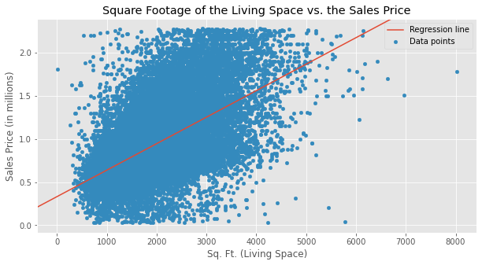

# King County Real Estate Analysis

**Author**: Andre Layton  
GitHub: @therookiescientist-andre

## Overview

  Keller Williams Realty has acquired some new property that they are looking to put on the market and sell within the next 1-2 years. Houses in their inventory are allotted more time before reselling, but this is their first property in the Pacific Northwest, and the company would like to use this project to aid in expanding their business into that region. This project aims to give Keller Williams an idea on what specific renovations they need to focus on in order to drive the sales price higher and by how much.
  
## Business Problem

  Keller Williams Realty would like to know what individual renovations will be necessary to increase the property's sales price prior to listing the house for sale. The company would also like to know how much of an impact the heating sources have on the property's value, and whether it is significant enough to consider for renovation. In order to identify which renovations should take priority, I am analyzing housing data from King County, WA in order to find these features and gain a better understanding of which features are the best predictors of sale price.
***

## Data & Methods

  The data analysed came from the King County government website. The dataset lists a full record of all the homes in the King County, WA area, and their corresponding features (i.e., size, price, floors, and etc.). The dataset is a combination of both numeric and categorical features, and will be studied to find which features in particular would have the best impact on sales price, and then help determine what renovations to focus on.

  After I explore the dataset and the distribution of the sales price, I clean up the dataframe by renaming columns and "dummying" out the heat sources column, in particular, in order to begin finding correlations and relationships. I use a heatmap to best show how each feature interacts with the sales price of the homes, and begin my feature selection process.
  
  
  
The heatmap shows that the size of the living room (in square feet) is the feature that is highly correlated with sales price, and is a predictor worth exploring. The business problem initially has interest in the homes' heat sources, which adds another feature to the project.   
***

## Modeling

  The first few plots explore a simple linear regression model between the size of the living room (in sq. ft.) and the sales price of the home. After dropping the outliers using the interquartile range (IQR) method, we plot the data along with a best-fit line to observe the effect our predictor has on the target. 
  
  
  
  The visual above shows that there is a strong linear relationship between the size of the living room and the sales price of the home. The model's adjusted R-squared statistic is .318 - in other words, the size of the living room explains about 32% of the variance in the sales price. The residuals are also plotted, as shown below, and exhibit a semblance of a normal distribution, which confirms that no assumptions were violated. 

  

  The next few visuals take a look into the heating sources and their impact on the sales price of the home. This data takes a different process due to its categorical nature, so a visual of the data's distribution is important. The first plot is a bar graph showing the average sales prices for each heating source.
  
  

  Gas-powered homes were valued at a higher price, on average, while electric-powered homes were valued the lowest, on average, and well below the dataset's mean, depicted by the horizontal line. The model explains about 3% of the variance in the sales price, which is quite small; however, the impact of the sales price depending on the heating source is the more important objective. The model suggests that, when compared to electric-powered homes, the home's sales price increases by $180,400 for gas-powered homes and $33,660 for oil-powered homes. 
  
  The last few visuals model all the individual predictors together, in order to achieve model improvement and observe what impact the predictors have on the sales price when factored in, completely. The model shows an improvement in the adjusted R-squared statistic (a value of 0.319) and statistically significant coefficients. The mean absolute error is $279,238, which is how much our model is off by in any given prediction. 

***


## Results & Conclusions

This analysis leads to the following conclusions:

1. Keller Williams should focus on renovating the living room, specifically by changing the size/square footage, and changing the heat source that powers the home. Each square foot that gets added to the living room is projected to increase the price of the home by $302. Increasing the square footage of the living room is confirmed to have the greatest impact to the sales price of the home, but is collinear with many other features and must, therefore, be modeled with a few select predictors.

2. I recommend renovating any homes acquired in this Pacific Northwest region to a gas-powered home, which is shown to have a higher sales price average, as well as increase the sales price, on average, by $97,000, which is the highest among the heating sources present in the model.

This project is limited in a few ways, the first being it only takes into account housing data within the upper and lower bounds of the dataset. However, if we were to include those high values and outliers, the results might show a higher variance in the price, a better model, and a lower mean absolute error. In addition, the dataset had limited features available that correlated well with price and not with one another.

Further analyses could yield additional insights to which features and/or renovations are best to impact the sales price of the homes in the Pacific Northwest region. One such improvement is including location into the project to see the impact area has on price. Also, include more features to explore other predictors that may correlate better with the sales price of the home.

***


## Repository Contents
***
Below is a list of the contents of this repository.

```
├── README.md             
├── images   
├── .gitignore
├── CONTRIBUTING.md   
├── LICENSE.md
├── KingCountyHousingDataAnalysis.ipynb                               
└── KingCountyRealEstateAnalysis.pdf                         
```
